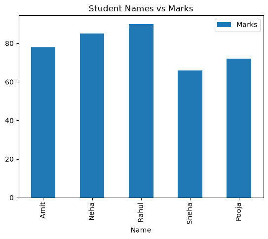
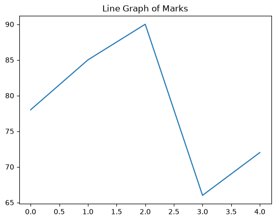
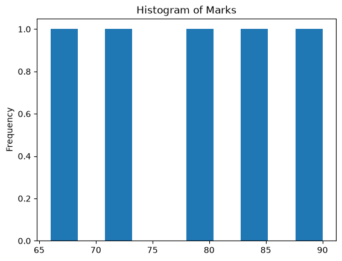
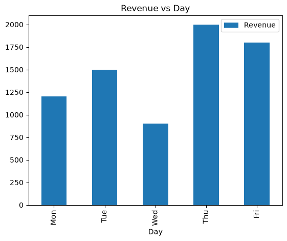

## Assignment 10 : PANDAS

## How to Run

### Option 1: Jupyter Notebook

1. Clone or download the repository.
2. Open a terminal in the project folder.
3. Install Jupyter Notebook if not already installed:

```bash
pip install notebook
```

4. Start Jupyter Notebook:

```bash
jupyter notebook
```

5. Open `pandas.ipynb`.
6. Run the cells one by one using:
   - **Shift + Enter**, or
   - **Run → Run All Cells**
### Option 2: VS Code

1. Open the project folder in VS Code.
2. Install the **Python** and **Jupyter** extensions.
3. Open the `.ipynb` file.
4. Click **Run All** or execute cells individually.
#### Task 1: Pandas Series Basic


```python
import pandas as pd
```


```python
marks = [78, 85, 90, 66, 72]
marks_series = pd.Series(marks)
marks_series
```


    0    78
    1    85
    2    90
    3    66
    4    72
    dtype: int64


```python
## Series Values
#marks_series.values
print(marks_series.values)
```

    [78 85 90 66 72]
    


```python
# Series Index
marks_series.index
```


    RangeIndex(start=0, stop=5, step=1)


```python
# Series Data Type
marks_series.dtype
```


    dtype('int64')


```python
# first element
marks_series.iloc[0]
```


    np.int64(78)


```python
# Last Two element
marks_series.iloc[-2:]
```


    3    66
    4    72
    dtype: int64


#### Task 2: Mathematical operation on series


```python
# plus 5 in marks
marks_plus = marks_series + 5
marks_plus
```


    0    83
    1    90
    2    95
    3    71
    4    77
    dtype: int64


```python
# minus 2 in marks
marks_minus = marks_series - 2
marks_minus
```


    0    76
    1    83
    2    88
    3    64
    4    70
    dtype: int64


```python
# multiply in series
marks_multiplied = marks_series * 1.05
marks_multiplied
```


    0    81.90
    1    89.25
    2    94.50
    3    69.30
    4    75.60
    dtype: float64


```python
# divide in series
marks_divided = marks_series / 2

marks_divided
```


    0    39.0
    1    42.5
    2    45.0
    3    33.0
    4    36.0
    dtype: float64


#### Task 3: Python Functionalities on series


```python
# Basic python operation on series
print("Maximum marks:", marks_series.max())
print("Minimum marks:", marks_series.min())
print("Sum of marks:", marks_series.sum())
print("Mean marks:", marks_series.mean())


```

    Maximum marks: 90
    Minimum marks: 66
    Sum of marks: 391
    Mean marks: 78.2
    


```python
passed = marks_series.apply(lambda mark: mark >= 70)

print("Pass status of each student:")
print(passed)

passed_count = passed.sum()

print("Number of students passed:", passed_count)
```

    Pass status of each student:
    0     True
    1     True
    2     True
    3    False
    4     True
    dtype: bool
    Number of students passed: 4
    

#### Task 4: Create a DataFrame


```python
# create data frame
students = {
    "Name": ["Amit", "Neha", "Rahul", "Sneha", "Pooja"],
    "Marks": [78, 85, 90, 66, 72],
    "Subject": ["Math", "Math", "Science", "Science", "Math"]
}

students_df = pd.DataFrame(students)

students_df

```


<div>
<style scoped>
    .dataframe tbody tr th:only-of-type {
        vertical-align: middle;
    }

    .dataframe tbody tr th {
        vertical-align: top;
    }

    .dataframe thead th {
        text-align: right;
    }
</style>
<table border="1" class="dataframe">
  <thead>
    <tr style="text-align: right;">
      <th></th>
      <th>Name</th>
      <th>Marks</th>
      <th>Subject</th>
    </tr>
  </thead>
  <tbody>
    <tr>
      <th>0</th>
      <td>Amit</td>
      <td>78</td>
      <td>Math</td>
    </tr>
    <tr>
      <th>1</th>
      <td>Neha</td>
      <td>85</td>
      <td>Math</td>
    </tr>
    <tr>
      <th>2</th>
      <td>Rahul</td>
      <td>90</td>
      <td>Science</td>
    </tr>
    <tr>
      <th>3</th>
      <td>Sneha</td>
      <td>66</td>
      <td>Science</td>
    </tr>
    <tr>
      <th>4</th>
      <td>Pooja</td>
      <td>72</td>
      <td>Math</td>
    </tr>
  </tbody>
</table>
</div>


```python
# Print first 3 rows
students_df.head(3)

```


<div>
<style scoped>
    .dataframe tbody tr th:only-of-type {
        vertical-align: middle;
    }

    .dataframe tbody tr th {
        vertical-align: top;
    }

    .dataframe thead th {
        text-align: right;
    }
</style>
<table border="1" class="dataframe">
  <thead>
    <tr style="text-align: right;">
      <th></th>
      <th>Name</th>
      <th>Marks</th>
      <th>Subject</th>
    </tr>
  </thead>
  <tbody>
    <tr>
      <th>0</th>
      <td>Amit</td>
      <td>78</td>
      <td>Math</td>
    </tr>
    <tr>
      <th>1</th>
      <td>Neha</td>
      <td>85</td>
      <td>Math</td>
    </tr>
    <tr>
      <th>2</th>
      <td>Rahul</td>
      <td>90</td>
      <td>Science</td>
    </tr>
  </tbody>
</table>
</div>


```python
# print last 2 rows
students_df.tail(2)

```


<div>
<style scoped>
    .dataframe tbody tr th:only-of-type {
        vertical-align: middle;
    }

    .dataframe tbody tr th {
        vertical-align: top;
    }

    .dataframe thead th {
        text-align: right;
    }
</style>
<table border="1" class="dataframe">
  <thead>
    <tr style="text-align: right;">
      <th></th>
      <th>Name</th>
      <th>Marks</th>
      <th>Subject</th>
    </tr>
  </thead>
  <tbody>
    <tr>
      <th>3</th>
      <td>Sneha</td>
      <td>66</td>
      <td>Science</td>
    </tr>
    <tr>
      <th>4</th>
      <td>Pooja</td>
      <td>72</td>
      <td>Math</td>
    </tr>
  </tbody>
</table>
</div>


```python
# shape of data frame rows and colums
students_df.shape


```


    (5, 3)


```python
# print column name
students_df.columns
```


    Index(['Name', 'Marks', 'Subject'], dtype='str')


#### Task 5: Important DataFrame Functions


```python
# print data frame info()
students_df.info()
```

    <class 'pandas.DataFrame'>
    RangeIndex: 5 entries, 0 to 4
    Data columns (total 3 columns):
     #   Column   Non-Null Count  Dtype
    ---  ------   --------------  -----
     0   Name     5 non-null      str  
     1   Marks    5 non-null      int64
     2   Subject  5 non-null      str  
    dtypes: int64(1), str(2)
    memory usage: 301.0 bytes
    


```python
# summery of data frame
students_df.describe()
```


<div>
<style scoped>
    .dataframe tbody tr th:only-of-type {
        vertical-align: middle;
    }

    .dataframe tbody tr th {
        vertical-align: top;
    }

    .dataframe thead th {
        text-align: right;
    }
</style>
<table border="1" class="dataframe">
  <thead>
    <tr style="text-align: right;">
      <th></th>
      <th>Marks</th>
    </tr>
  </thead>
  <tbody>
    <tr>
      <th>count</th>
      <td>5.000000</td>
    </tr>
    <tr>
      <th>mean</th>
      <td>78.200000</td>
    </tr>
    <tr>
      <th>std</th>
      <td>9.654015</td>
    </tr>
    <tr>
      <th>min</th>
      <td>66.000000</td>
    </tr>
    <tr>
      <th>25%</th>
      <td>72.000000</td>
    </tr>
    <tr>
      <th>50%</th>
      <td>78.000000</td>
    </tr>
    <tr>
      <th>75%</th>
      <td>85.000000</td>
    </tr>
    <tr>
      <th>max</th>
      <td>90.000000</td>
    </tr>
  </tbody>
</table>
</div>


```python
# print first rows of data frame
students_df.head(2)
```


<div>
<style scoped>
    .dataframe tbody tr th:only-of-type {
        vertical-align: middle;
    }

    .dataframe tbody tr th {
        vertical-align: top;
    }

    .dataframe thead th {
        text-align: right;
    }
</style>
<table border="1" class="dataframe">
  <thead>
    <tr style="text-align: right;">
      <th></th>
      <th>Name</th>
      <th>Marks</th>
      <th>Subject</th>
    </tr>
  </thead>
  <tbody>
    <tr>
      <th>0</th>
      <td>Amit</td>
      <td>78</td>
      <td>Math</td>
    </tr>
    <tr>
      <th>1</th>
      <td>Neha</td>
      <td>85</td>
      <td>Math</td>
    </tr>
  </tbody>
</table>
</div>


```python
# last 2 rows
students_df.tail(2)
```


<div>
<style scoped>
    .dataframe tbody tr th:only-of-type {
        vertical-align: middle;
    }

    .dataframe tbody tr th {
        vertical-align: top;
    }

    .dataframe thead th {
        text-align: right;
    }
</style>
<table border="1" class="dataframe">
  <thead>
    <tr style="text-align: right;">
      <th></th>
      <th>Name</th>
      <th>Marks</th>
      <th>Subject</th>
    </tr>
  </thead>
  <tbody>
    <tr>
      <th>3</th>
      <td>Sneha</td>
      <td>66</td>
      <td>Science</td>
    </tr>
    <tr>
      <th>4</th>
      <td>Pooja</td>
      <td>72</td>
      <td>Math</td>
    </tr>
  </tbody>
</table>
</div>


```python
# sort data frame by marks
sorted_students = students_df.sort_values(
    by="Marks",
    ascending=False
)
sorted_students
```


<div>
<style scoped>
    .dataframe tbody tr th:only-of-type {
        vertical-align: middle;
    }

    .dataframe tbody tr th {
        vertical-align: top;
    }

    .dataframe thead th {
        text-align: right;
    }
</style>
<table border="1" class="dataframe">
  <thead>
    <tr style="text-align: right;">
      <th></th>
      <th>Name</th>
      <th>Marks</th>
      <th>Subject</th>
    </tr>
  </thead>
  <tbody>
    <tr>
      <th>2</th>
      <td>Rahul</td>
      <td>90</td>
      <td>Science</td>
    </tr>
    <tr>
      <th>1</th>
      <td>Neha</td>
      <td>85</td>
      <td>Math</td>
    </tr>
    <tr>
      <th>0</th>
      <td>Amit</td>
      <td>78</td>
      <td>Math</td>
    </tr>
    <tr>
      <th>4</th>
      <td>Pooja</td>
      <td>72</td>
      <td>Math</td>
    </tr>
    <tr>
      <th>3</th>
      <td>Sneha</td>
      <td>66</td>
      <td>Science</td>
    </tr>
  </tbody>
</table>
</div>


```python
# reset index after sorting
sorted_students = sorted_students.reset_index(drop=True)
sorted_students
```


<div>
<style scoped>
    .dataframe tbody tr th:only-of-type {
        vertical-align: middle;
    }

    .dataframe tbody tr th {
        vertical-align: top;
    }

    .dataframe thead th {
        text-align: right;
    }
</style>
<table border="1" class="dataframe">
  <thead>
    <tr style="text-align: right;">
      <th></th>
      <th>Name</th>
      <th>Marks</th>
      <th>Subject</th>
    </tr>
  </thead>
  <tbody>
    <tr>
      <th>0</th>
      <td>Rahul</td>
      <td>90</td>
      <td>Science</td>
    </tr>
    <tr>
      <th>1</th>
      <td>Neha</td>
      <td>85</td>
      <td>Math</td>
    </tr>
    <tr>
      <th>2</th>
      <td>Amit</td>
      <td>78</td>
      <td>Math</td>
    </tr>
    <tr>
      <th>3</th>
      <td>Pooja</td>
      <td>72</td>
      <td>Math</td>
    </tr>
    <tr>
      <th>4</th>
      <td>Sneha</td>
      <td>66</td>
      <td>Science</td>
    </tr>
  </tbody>
</table>
</div>


#### Task 6: Filtring & Conditional Selection


```python
# student score more then 75
more_than_75 = students_df[students_df["Marks"] > 75]
more_than_75
```


<div>
<style scoped>
    .dataframe tbody tr th:only-of-type {
        vertical-align: middle;
    }

    .dataframe tbody tr th {
        vertical-align: top;
    }

    .dataframe thead th {
        text-align: right;
    }
</style>
<table border="1" class="dataframe">
  <thead>
    <tr style="text-align: right;">
      <th></th>
      <th>Name</th>
      <th>Marks</th>
      <th>Subject</th>
    </tr>
  </thead>
  <tbody>
    <tr>
      <th>0</th>
      <td>Amit</td>
      <td>78</td>
      <td>Math</td>
    </tr>
    <tr>
      <th>1</th>
      <td>Neha</td>
      <td>85</td>
      <td>Math</td>
    </tr>
    <tr>
      <th>2</th>
      <td>Rahul</td>
      <td>90</td>
      <td>Science</td>
    </tr>
  </tbody>
</table>
</div>


```python
# math students
math_students = students_df[students_df["Subject"] == "Math"]
math_students
```


<div>
<style scoped>
    .dataframe tbody tr th:only-of-type {
        vertical-align: middle;
    }

    .dataframe tbody tr th {
        vertical-align: top;
    }

    .dataframe thead th {
        text-align: right;
    }
</style>
<table border="1" class="dataframe">
  <thead>
    <tr style="text-align: right;">
      <th></th>
      <th>Name</th>
      <th>Marks</th>
      <th>Subject</th>
    </tr>
  </thead>
  <tbody>
    <tr>
      <th>0</th>
      <td>Amit</td>
      <td>78</td>
      <td>Math</td>
    </tr>
    <tr>
      <th>1</th>
      <td>Neha</td>
      <td>85</td>
      <td>Math</td>
    </tr>
    <tr>
      <th>4</th>
      <td>Pooja</td>
      <td>72</td>
      <td>Math</td>
    </tr>
  </tbody>
</table>
</div>


```python
# average marks
average_marks = students_df["Marks"].mean()
average_marks
```


    np.float64(78.2)


```python
# above average marks student
above_average = students_df[students_df["Marks"] > average_marks]
above_average
```


<div>
<style scoped>
    .dataframe tbody tr th:only-of-type {
        vertical-align: middle;
    }

    .dataframe tbody tr th {
        vertical-align: top;
    }

    .dataframe thead th {
        text-align: right;
    }
</style>
<table border="1" class="dataframe">
  <thead>
    <tr style="text-align: right;">
      <th></th>
      <th>Name</th>
      <th>Marks</th>
      <th>Subject</th>
    </tr>
  </thead>
  <tbody>
    <tr>
      <th>1</th>
      <td>Neha</td>
      <td>85</td>
      <td>Math</td>
    </tr>
    <tr>
      <th>2</th>
      <td>Rahul</td>
      <td>90</td>
      <td>Science</td>
    </tr>
  </tbody>
</table>
</div>


```python
# failed students
failed_students = students_df[students_df["Marks"] < 70]
failed_students
```


<div>
<style scoped>
    .dataframe tbody tr th:only-of-type {
        vertical-align: middle;
    }

    .dataframe tbody tr th {
        vertical-align: top;
    }

    .dataframe thead th {
        text-align: right;
    }
</style>
<table border="1" class="dataframe">
  <thead>
    <tr style="text-align: right;">
      <th></th>
      <th>Name</th>
      <th>Marks</th>
      <th>Subject</th>
    </tr>
  </thead>
  <tbody>
    <tr>
      <th>3</th>
      <td>Sneha</td>
      <td>66</td>
      <td>Science</td>
    </tr>
  </tbody>
</table>
</div>


#### Task 7: Grouping & basic analysis


```python
# average marks per subject
average_marks_per_subject = students_df.groupby("Subject")["Marks"].mean()
average_marks_per_subject
```


    Subject
    Math       78.333333
    Science    78.000000
    Name: Marks, dtype: float64


```python
# student counts per subject
student_count_per_subject = students_df.groupby("Subject")["Name"].count()
student_count_per_subject
```


    Subject
    Math       3
    Science    2
    Name: Name, dtype: int64


```python
# maximum marks in subject

maximum_marks_per_subject = students_df.groupby("Subject")["Marks"].max()
maximum_marks_per_subject
```


    Subject
    Math       85
    Science    90
    Name: Marks, dtype: int64


#### Task 8: Pandas Plotting


```python
students_df.plot(
    x="Name",
    y="Marks",
    kind="bar",
    title="Student Names vs Marks"
)
```


    <Axes: title={'center': 'Student Names vs Marks'}, xlabel='Name'>


    

    


```python
students_df["Marks"].plot(
    kind="line",
    title="Line Graph of Marks"
)
```


    <Axes: title={'center': 'Line Graph of Marks'}>


    

    


```python
students_df["Marks"].plot(
    kind="hist",
    title="Histogram of Marks"
)
```


    <Axes: title={'center': 'Histogram of Marks'}, ylabel='Frequency'>


    

    


#### Task 9: Mini Use Case : Sale Data Analysis


```python
# creating dataFrame
sales = {
    "Day": ["Mon", "Tue", "Wed", "Thu", "Fri"],
    "Revenue": [1200, 1500, 900, 2000, 1800]
}

sales_df = pd.DataFrame(sales)

sales_df
```


<div>
<style scoped>
    .dataframe tbody tr th:only-of-type {
        vertical-align: middle;
    }

    .dataframe tbody tr th {
        vertical-align: top;
    }

    .dataframe thead th {
        text-align: right;
    }
</style>
<table border="1" class="dataframe">
  <thead>
    <tr style="text-align: right;">
      <th></th>
      <th>Day</th>
      <th>Revenue</th>
    </tr>
  </thead>
  <tbody>
    <tr>
      <th>0</th>
      <td>Mon</td>
      <td>1200</td>
    </tr>
    <tr>
      <th>1</th>
      <td>Tue</td>
      <td>1500</td>
    </tr>
    <tr>
      <th>2</th>
      <td>Wed</td>
      <td>900</td>
    </tr>
    <tr>
      <th>3</th>
      <td>Thu</td>
      <td>2000</td>
    </tr>
    <tr>
      <th>4</th>
      <td>Fri</td>
      <td>1800</td>
    </tr>
  </tbody>
</table>
</div>


```python
# find total revenue

total_revenue = sales_df["Revenue"].sum()
total_revenue
```


    np.int64(7400)


```python
# average revenue
average_revenue = sales_df["Revenue"].mean()
average_revenue
```


    np.float64(1480.0)


```python
# highest revenue day
highest_revenue_day = sales_df.loc[
    sales_df["Revenue"].idxmax(), "Day"
]

highest_revenue_day
```


    'Thu'


```python
# days with above average revenue

above_average_days = sales_df[
    sales_df["Revenue"] > average_revenue
]

above_average_days

```


<div>
<style scoped>
    .dataframe tbody tr th:only-of-type {
        vertical-align: middle;
    }

    .dataframe tbody tr th {
        vertical-align: top;
    }

    .dataframe thead th {
        text-align: right;
    }
</style>
<table border="1" class="dataframe">
  <thead>
    <tr style="text-align: right;">
      <th></th>
      <th>Day</th>
      <th>Revenue</th>
    </tr>
  </thead>
  <tbody>
    <tr>
      <th>1</th>
      <td>Tue</td>
      <td>1500</td>
    </tr>
    <tr>
      <th>3</th>
      <td>Thu</td>
      <td>2000</td>
    </tr>
    <tr>
      <th>4</th>
      <td>Fri</td>
      <td>1800</td>
    </tr>
  </tbody>
</table>
</div>


```python
sales_df.plot(
    x="Day",
    y="Revenue",
    kind="bar",
    title="Revenue vs Day"
)
```


    <Axes: title={'center': 'Revenue vs Day'}, xlabel='Day'>


    

    


```python

```
